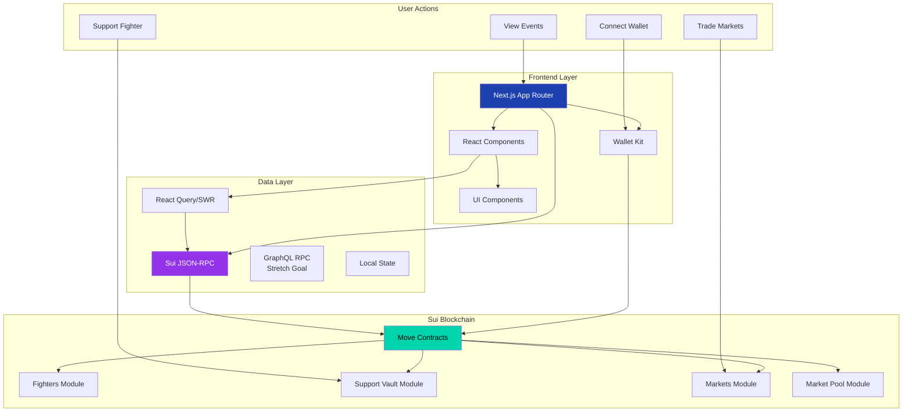
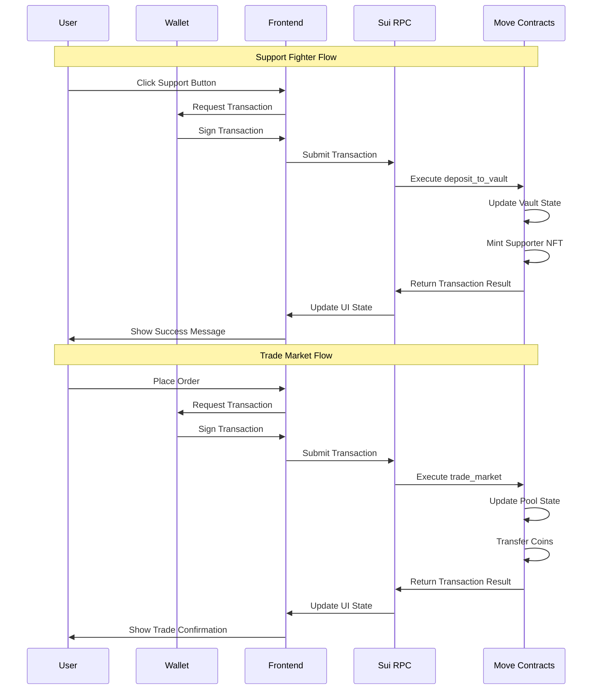
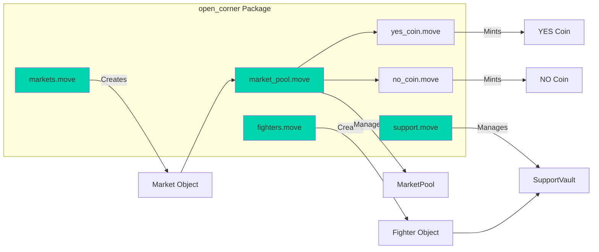
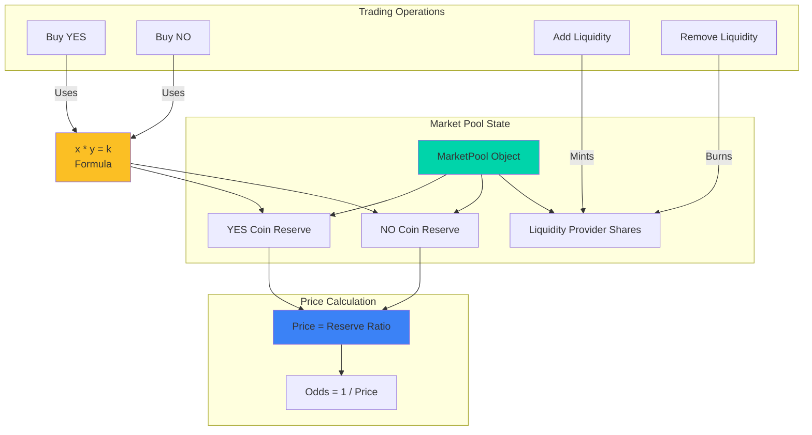
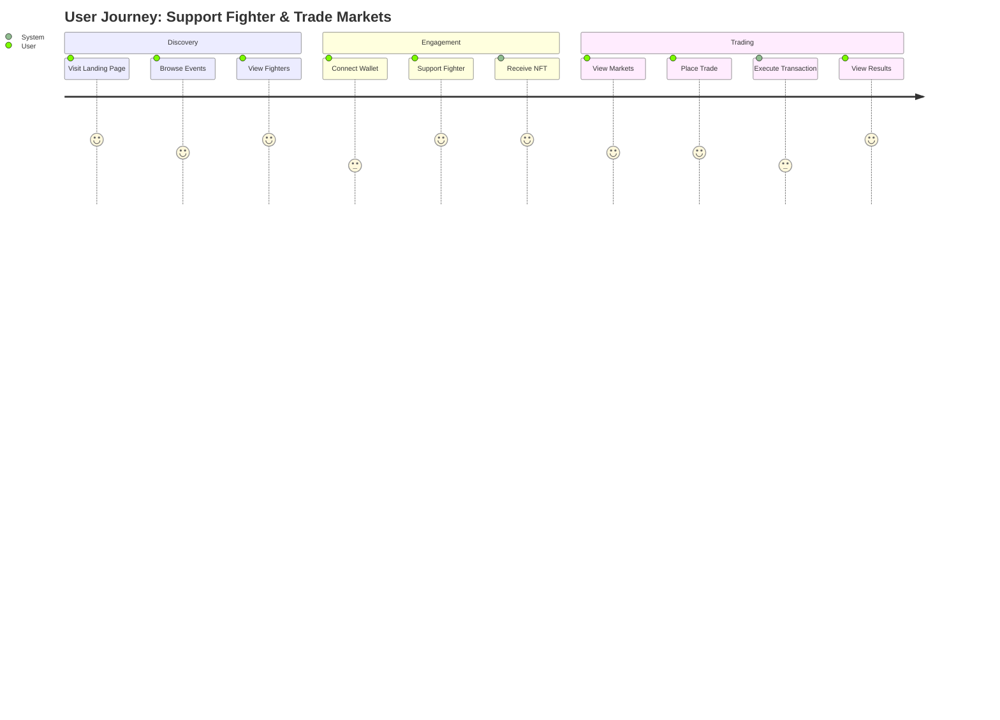
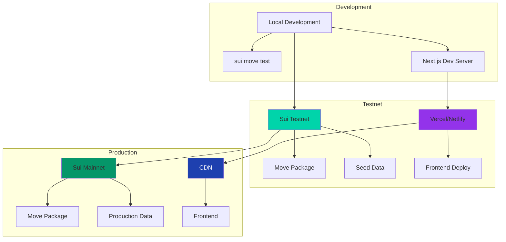
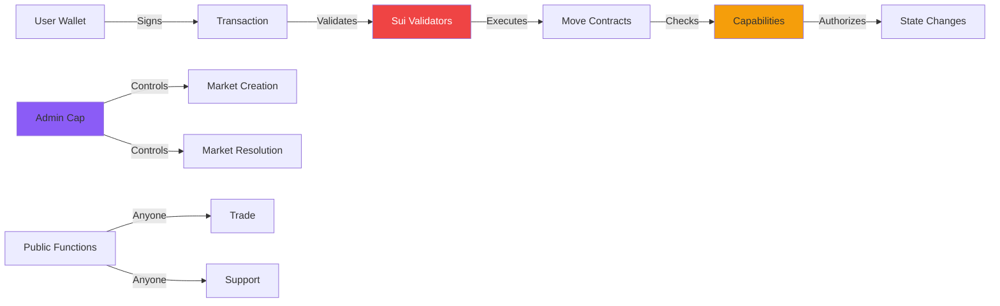

# ONE Fight Arena DAO - アーキテクチャ図

## システム全体アーキテクチャ



## データフロー図



## Move モジュール構造



## フロントエンドコンポーネント構造

```mermaid
graph TD
    A[app/]
    A --> B[page.tsx<br/>Landing]
    A --> C[markets/page.tsx]
    A --> D[fighters/page.tsx]
    A --> E[event/[slug]/page.tsx]
    
    F[components/]
    F --> G[market/]
    F --> H[support/]
    F --> I[event/]
    F --> J[ui/]
    
    G --> K[MarketCard]
    G --> L[MarketsTab]
    G --> M[OrderBook]
    G --> N[PlaceOrder]
    
    H --> O[SupportTab]
    H --> P[SupportDialog]
    
    I --> Q[EventCard]
    I --> R[EventList]
    
    L[lib/]
    L --> S[sui/]
    S --> T[client.ts]
    S --> U[transactions.ts]
    S --> V[queries.ts]
    
    style A fill:#1e40af,color:#fff
    style F fill:#9333ea,color:#fff
    style L fill:#059669,color:#fff
```

## CPMM (Constant Product Market Maker) アーキテクチャ



## ユーザージャーニー



## デプロイメントアーキテクチャ



## セキュリティモデル



