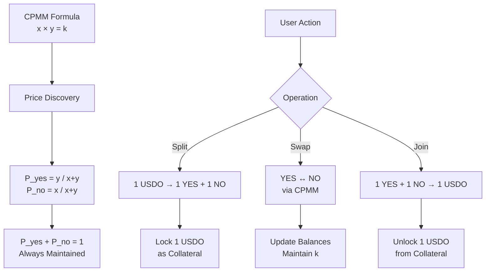
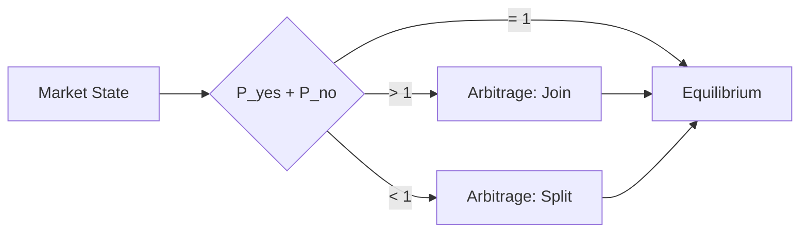
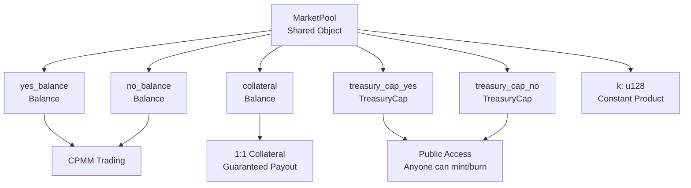
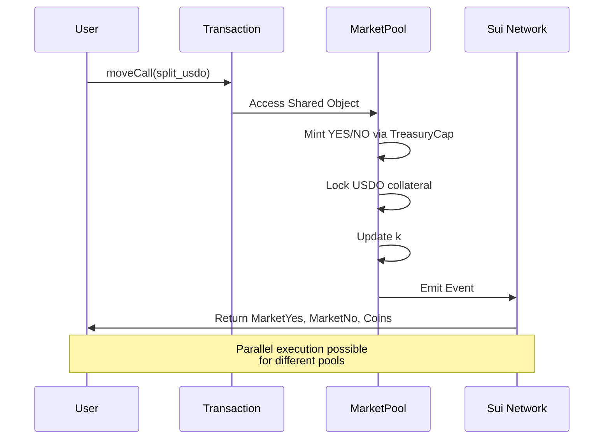

# CPMM Prediction Market: Logic & Sui Implementation

## Slide 1: CPMM Logic & Core Mechanics

### Constant Product Market Maker Formula



### Core Operations

**1. Split (USDO → YES + NO)**
```
Input: 1 USDO
Process:
  - Mint 1 YES_COIN via TreasuryCap
  - Mint 1 NO_COIN via TreasuryCap
  - Lock 1 USDO as collateral
  - Add to pool: yes_balance += 1, no_balance += 1
  - Update k = yes_balance × no_balance
Output: MarketYes, MarketNo, YES_COIN, NO_COIN
```

**2. Swap (YES ↔ NO)**
```
CPMM Formula: (x + Δx) × (y - Δy) = k

Swap YES for NO:
  Δy = (y × Δx) / (x + Δx)
  
Example:
  Initial: x=1000, y=1000, k=1,000,000
  Input: 100 YES
  Output: (1000 × 100) / (1000 + 100) ≈ 91 NO
  New state: x=1100, y=909, k=998,700 ≈ 1,000,000
  Price: P_yes = 1100/2009 ≈ 54.8%
```

**3. Join (YES + NO → USDO)**
```
Input: 1 YES + 1 NO (must be 1:1 pair)
Process:
  - Verify market_id match (security)
  - Burn YES_COIN via TreasuryCap
  - Burn NO_COIN via TreasuryCap
  - Unlock 1 USDO from collateral
Output: 1 USDO
```

### Price Discovery & Arbitrage



**Arbitrage Mechanism:**
- If `P_yes + P_no > 1`: Users join coins → price decreases
- If `P_yes + P_no < 1`: Users split USDO → price increases
- Ensures `P_yes + P_no = 1` convergence

---

## Slide 2: Sui Implementation Architecture

### MarketPool Structure



### Move Implementation

```move
public struct MarketPool has key {
    id: UID,
    market_id: ID,
    yes_balance: Balance<YES_COIN>,
    no_balance: Balance<NO_COIN>,
    k: u128,  // Constant: yes_balance × no_balance
    collateral: Balance<USDO>,
    treasury_cap_yes: TreasuryCap<YES_COIN>,  // Stored in pool
    treasury_cap_no: TreasuryCap<NO_COIN>,     // for public access
}
```

### Key Design Decisions

**1. Shared Object for Public Access**
```move
transfer::share_object(pool);  // Anyone can access
```
- ✅ No permission required
- ✅ Parallel execution enabled
- ✅ TreasuryCaps stored in pool (decentralized)

**2. Balance vs Coin Pattern**
```move
// Internal storage: Balance<T>
balance::join(&mut pool.yes_balance, coin::into_balance(coin));

// User transfer: Coin<T>
let coin = coin::from_balance(balance, ctx);
```
- **Balance**: Pool internal storage (not transferable)
- **Coin**: User-owned, transferable objects

**3. Security: Market-Specific Wrappers**
```move
public struct MarketYes has key, store {
    id: UID,
    market_id: ID,  // Prevents cross-market attacks
    amount: u64,
}

// Join verification
assert!(market_yes.market_id == pool.market_id, E_WRONG_MARKET);
assert!(yes_amount == no_amount, E_INVALID_PAIR);  // 1:1 enforced
```

### Sui Advantages vs Ethereum

| Feature | Ethereum | Sui |
|---------|----------|-----|
| **Storage** | Global state | Object-based |
| **Access Control** | `msg.sender` | Object ownership |
| **Execution** | Sequential | Parallel |
| **Coins** | `uint256` | `Coin<T>` / `Balance<T>` |
| **Initial Liquidity** | Required | Auto-generated |
| **TreasuryCap Access** | Owner-only | Public (via Shared Object) |

### Transaction Flow



### Implementation Highlights

**Swap Calculation (No Fee MVP):**
```move
// CPMM: (x + Δx) × (y - Δy) = k
// Solving: Δy = (y × Δx) / (x + Δx)
let numerator = (no_balance as u128) * (yes_in as u128);
let denominator = (yes_balance as u128) + (yes_in as u128);
let no_out = (numerator / denominator) as u64;
```

**Collateral Guarantee:**
- 1 USDO locked per (1 YES + 1 NO) pair
- 1:1 redemption guaranteed: `1 YES = 1 USDO` (if winning)
- No fractional reserve: `collateral == total YES + NO`

**Parallel Execution:**
- Different MarketPools can process transactions in parallel
- Sui's object-based model enables high throughput
- No global state contention
