# CPMM予測市場 - ロジックとSui実装

## スライド1: CPMMとは？

### Constant Product Market Maker (CPMM)

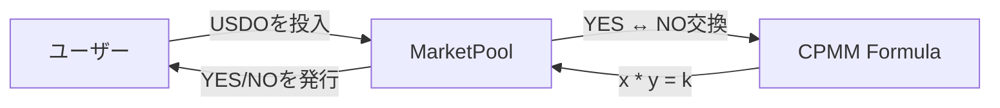

**基本公式:**
```
x * y = k (constant product)
```

- **x**: YES_COINの残高
- **y**: NO_COINの残高  
- **k**: 定数積（取引後も維持される）

**価格計算:**
```
P_yes = y / (x + y)
P_no = x / (x + y)
P_yes + P_no = 1 (常に成立)
```

---

## スライド2: CPMMの動作原理

### 取引例

**初期状態:**
- YES残高: 1000
- NO残高: 1000
- k = 1,000,000

**YESを100枚購入する場合:**
```
新しいYES残高 = 1000 + 100 = 1100
k = 1,000,000 (維持)
新しいNO残高 = 1,000,000 / 1100 ≈ 909

受け取れるNO = 1000 - 909 = 91枚
```

**価格の変化:**
```
購入前: P_yes = 1000/2000 = 50%
購入後: P_yes = 1100/2009 ≈ 54.8%
```

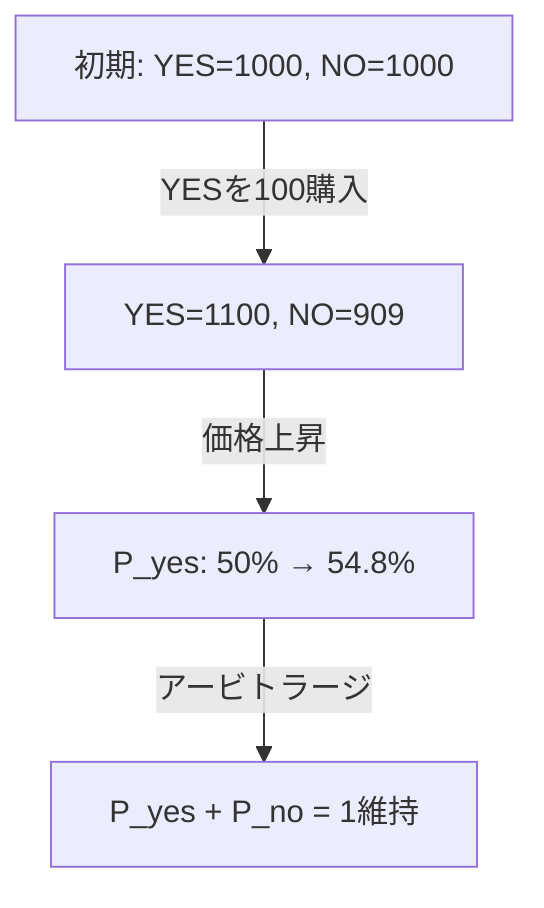

---

## スライド3: Suiでの実装アーキテクチャ

### MarketPool構造体

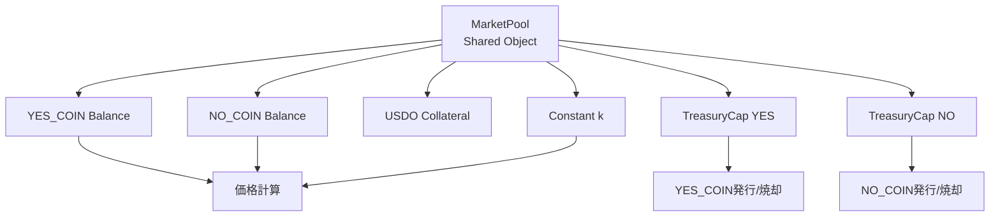

**Moveコード:**
```move
public struct MarketPool has key {
    id: UID,
    market_id: ID,
    yes_balance: Balance<YES_COIN>,
    no_balance: Balance<NO_COIN>,
    k: u128,  // Constant product
    collateral: Balance<USDO>,
    treasury_cap_yes: TreasuryCap<YES_COIN>,
    treasury_cap_no: TreasuryCap<NO_COIN>,
}
```

---

## スライド4: コア機能 - Split (USDO → YES + NO)

### Split機能のフロー

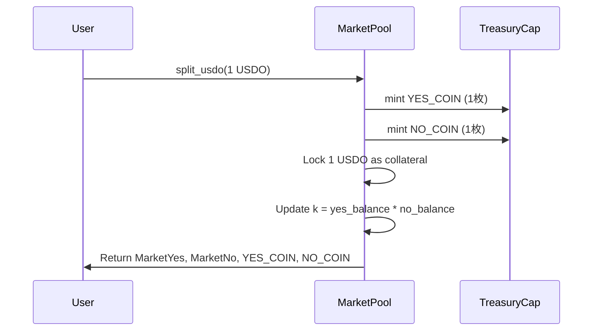

**実装ロジック:**
```move
public fun split_usdo(
    pool: &mut MarketPool,
    usdo_coin: Coin<USDO>,
    ctx: &mut TxContext,
): (MarketYes, MarketNo, Coin<YES_COIN>, Coin<NO_COIN>) {
    let usdo_amount = coin::value(&usdo_coin);
    
    // 1. Lock USDO as collateral
    balance::join(&mut pool.collateral, coin::into_balance(usdo_coin));
    
    // 2. Mint YES and NO coins (1:1 ratio)
    let yes_coin = coin::mint(&mut pool.treasury_cap_yes, usdo_amount, ctx);
    let no_coin = coin::mint(&mut pool.treasury_cap_no, usdo_amount, ctx);
    
    // 3. Add to pool balances
    balance::join(&mut pool.yes_balance, coin::into_balance(yes_coin));
    balance::join(&mut pool.no_balance, coin::into_balance(no_coin));
    
    // 4. Update k (constant product)
    let yes_bal = balance::value(&pool.yes_balance);
    let no_bal = balance::value(&pool.no_balance);
    pool.k = (yes_bal as u128) * (no_bal as u128);
    
    // 5. Create wrappers and return coins
    // ...
}
```

**特徴:**
- ✅ 1 USDO → 1 YES + 1 NO (1:1比率)
- ✅ USDOは担保としてロック
- ✅ kが自動更新される

---

## スライド5: コア機能 - Swap (YES ↔ NO)

### Swap機能のフロー

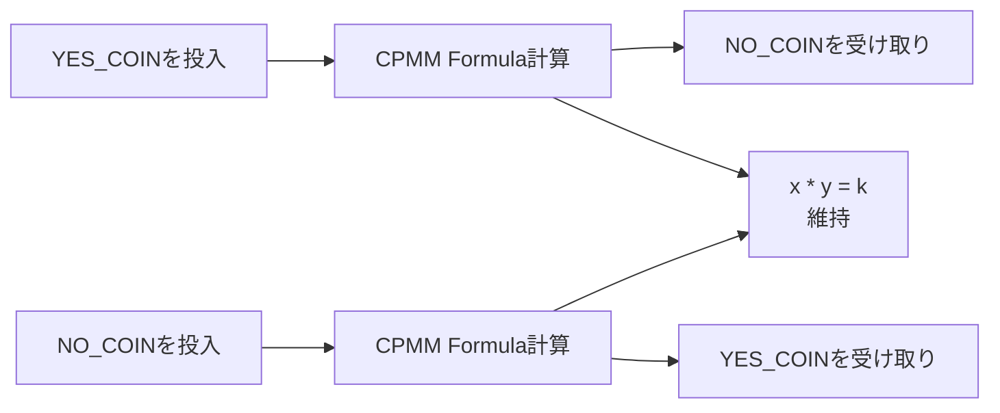

**実装ロジック:**
```move
public fun swap_yes_for_no(
    pool: &mut MarketPool,
    yes_coin: Coin<YES_COIN>,
    ctx: &mut TxContext,
): Coin<NO_COIN> {
    let yes_in = coin::value(&yes_coin);
    let yes_bal = balance::value(&pool.yes_balance);
    let no_bal = balance::value(&pool.no_balance);
    
    // CPMM公式: (yes_balance + yes_in) * (no_balance - no_out) = k
    // 解くと: no_out = (no_balance * yes_in) / (yes_balance + yes_in)
    let numerator = (no_bal as u128) * (yes_in as u128);
    let denominator = (yes_bal as u128) + (yes_in as u128);
    let no_out = (numerator / denominator) as u64;
    
    // Add YES to pool
    balance::join(&mut pool.yes_balance, coin::into_balance(yes_coin));
    
    // Remove NO from pool
    let no_balance = balance::split(&mut pool.no_balance, no_out);
    let no_coin = coin::from_balance(no_balance, ctx);
    
    // k is maintained automatically
    pool.k = (yes_bal + yes_in) as u128 * (no_bal - no_out) as u128;
    
    no_coin
}
```

**価格スリッページ:**
- 大量取引ほど価格が不利になる
- プールの流動性が大きいほどスリッページが小さい

---

## スライド6: コア機能 - Join (YES + NO → USDO)

### Join機能のフロー

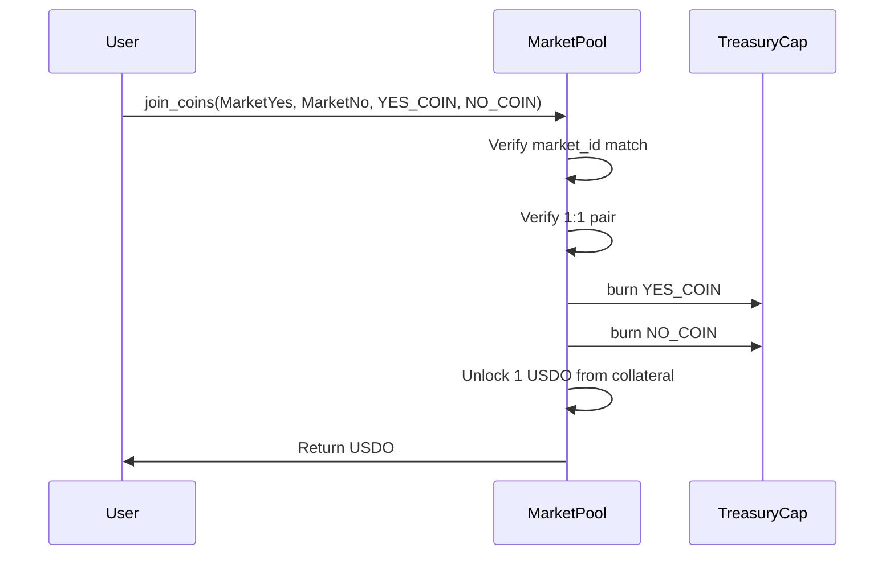

**実装ロジック:**
```move
public fun join_coins(
    pool: &mut MarketPool,
    market_yes: MarketYes,
    market_no: MarketNo,
    yes_coin: Coin<YES_COIN>,
    no_coin: Coin<NO_COIN>,
    ctx: &mut TxContext,
): Coin<USDO> {
    // 1. Verify market_id (prevents cross-market attacks)
    assert!(market_yes.market_id == pool.market_id, E_WRONG_MARKET);
    assert!(market_no.market_id == pool.market_id, E_WRONG_MARKET);
    
    // 2. Verify 1:1 pair
    let yes_amount = coin::value(&yes_coin);
    let no_amount = coin::value(&no_coin);
    assert!(yes_amount == no_amount, E_INVALID_PAIR);
    
    // 3. Burn YES and NO
    coin::burn(&mut pool.treasury_cap_yes, yes_coin);
    coin::burn(&mut pool.treasury_cap_no, no_coin);
    
    // 4. Unlock USDO from collateral (1:1 exchange)
    let usdo_balance = balance::split(&mut pool.collateral, yes_amount);
    let usdo_coin = coin::from_balance(usdo_balance, ctx);
    
    // 5. Update pool balances and k
    // ...
    
    usdo_coin
}
```

**アービトラージの役割:**
- P_yes + P_no > 1 → Joinで利益
- P_yes + P_no < 1 → Splitで利益
- これにより価格が1に収束

---

## スライド7: Suiの特徴を活かした設計

### 1. Shared Objectによる分散アクセス

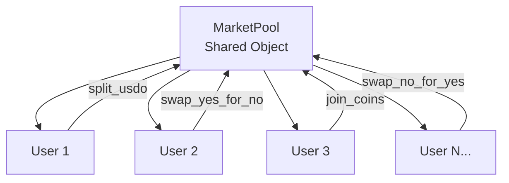

**利点:**
- ✅ 誰でもアクセス可能（パーミッション不要）
- ✅ 並列実行可能（Suiの並列処理の恩恵）
- ✅ TreasuryCapをプールに保存して公開アクセス可能

### 2. Balance vs Coinの使い分け

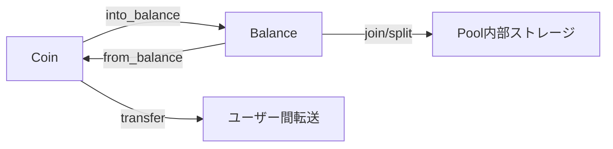

**設計思想:**
- **Coin**: ユーザーが所有・転送可能
- **Balance**: プール内部のストレージ用
- **変換**: `coin::into_balance()` / `coin::from_balance()`

### 3. オブジェクト所有権モデル

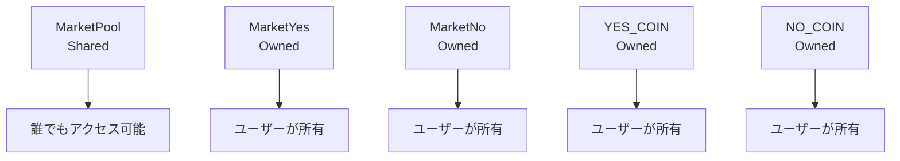

**セキュリティ:**
- MarketYes/Noに`market_id`を含めることでクロスマーケット攻撃を防止
- オブジェクトの所有権でアクセス制御

---

## スライド8: セキュリティ対策

### 1. クロスマーケット攻撃の防止

```move
// MarketYes/Noにmarket_idを含める
public struct MarketYes has key, store {
    id: UID,
    market_id: ID,  // ← これで市場を特定
    amount: u64,
}

// Join時に検証
assert!(market_yes.market_id == pool.market_id, E_WRONG_MARKET);
assert!(market_no.market_id == pool.market_id, E_WRONG_MARKET);
```

### 2. 1:1ペアの強制

```move
// Join時は必ず1:1のペアが必要
assert!(yes_amount == no_amount, E_INVALID_PAIR);
assert!(market_yes.amount == yes_amount, E_INVALID_PAIR);
assert!(market_no.amount == no_amount, E_INVALID_PAIR);
```

### 3. 無担保発行の防止

```move
// Split時は必ずUSDOを担保としてロック
balance::join(&mut pool.collateral, coin::into_balance(usdo_coin));

// Join時は必ず担保からUSDOをアンロック
let usdo_balance = balance::split(&mut pool.collateral, yes_amount);
```

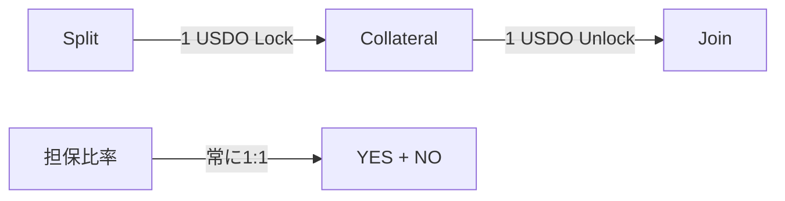

---

## スライド9: 取引フローの全体像

### 完全なユーザージャーニー

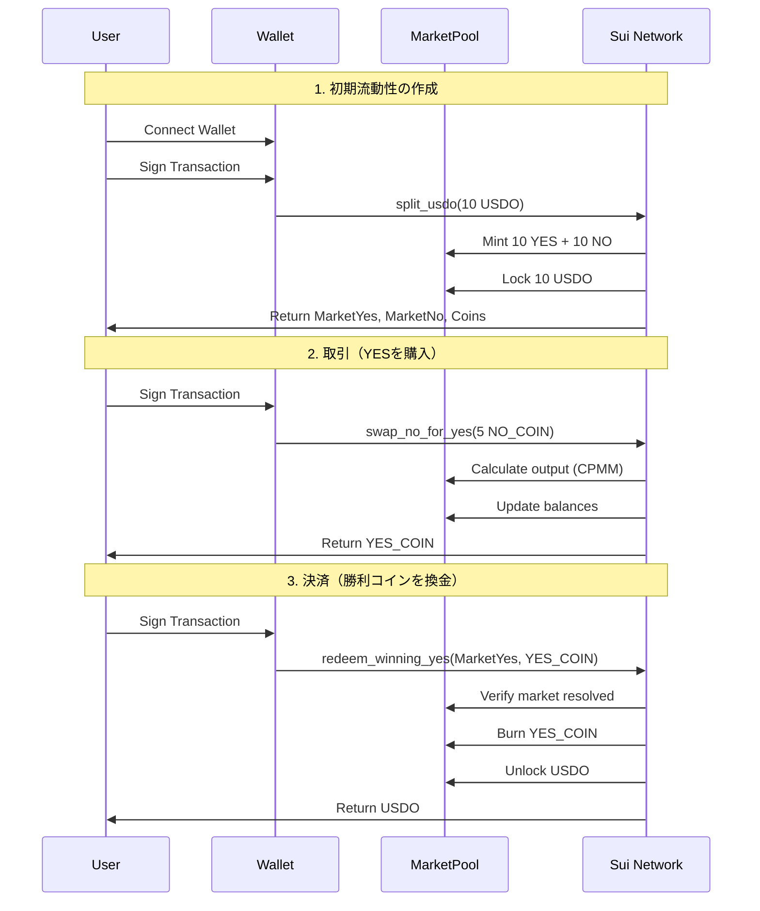

---

## スライド10: Ethereumとの違い

### アーキテクチャの比較

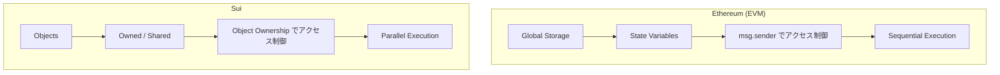

| 項目 | Ethereum | Sui |
|------|----------|-----|
| **ストレージ** | グローバルストレージ | オブジェクトベース |
| **アクセス制御** | `msg.sender` | オブジェクト所有権 |
| **実行** | 逐次実行 | 並列実行可能 |
| **コイン** | `uint256 balance` | `Coin<T>` / `Balance<T>` |
| **初期流動性** | 必要 | 不要（最初の取引で自動生成） |

### Suiの利点

1. **並列実行**
   - 異なるMarketPoolへの取引を並列実行可能
   - スループットが向上

2. **オブジェクト所有権**
   - 明確な所有権モデル
   - セキュリティが向上

3. **初期流動性不要**
   - 最初の`split_usdo`で自動的に流動性が生成
   - より柔軟な市場作成

---

## スライド11: 実装の数値例

### シナリオ: 市場のライフサイクル

**ステップ1: 初期化**
```
MarketPool作成
- yes_balance = 0
- no_balance = 0
- k = 0
- collateral = 0
```

**ステップ2: 最初のSplit（10 USDO）**
```
Input: 10 USDO
Output: 10 YES + 10 NO
- yes_balance = 10
- no_balance = 10
- k = 10 * 10 = 100
- collateral = 10 USDO
- P_yes = 10/20 = 50%
- P_no = 10/20 = 50%
```

**ステップ3: YESを5枚購入（5 NOを投入）**
```
Input: 5 NO
CPMM計算: (10 + 0) * (10 - no_out) = 100
no_out = (10 * 5) / (10 + 0) = 5

Output: 5 YES
- yes_balance = 10 - 5 = 5
- no_balance = 10 + 5 = 15
- k = 5 * 15 = 75 (維持)
- P_yes = 5/20 = 25%
- P_no = 15/20 = 75%
```

**ステップ4: アービトラージ（Join）**
```
P_yes + P_no = 25% + 75% = 100% ✓
（既に1に収束している）
```


---

## スライド12: まとめ

### CPMM予測市場の特徴

✅ **シンプルな公式**: `x * y = k`
✅ **自動価格発見**: 需要と供給で価格が決定
✅ **流動性保証**: 常に取引可能
✅ **アービトラージ**: P_yes + P_no = 1 に自動収束

### Sui実装の利点

✅ **Shared Object**: 誰でもアクセス可能
✅ **並列実行**: 高いスループット
✅ **オブジェクト所有権**: 明確なセキュリティモデル
✅ **初期流動性不要**: 柔軟な市場作成

### 実装のポイント

1. **Balance/Coinの使い分け**
   - プール内部: `Balance<T>`
   - ユーザー間: `Coin<T>`

2. **TreasuryCapの管理**
   - MarketPoolに保存して公開アクセス可能
   - 誰でも`split_usdo`を呼び出せる

3. **セキュリティ**
   - MarketYes/Noでクロスマーケット攻撃を防止
   - 1:1ペアの強制で無担保発行を防止

---

## 補足: 数式の詳細

### CPMM公式の導出

**基本条件:**
```
x * y = k (constant)
```

**YESをΔx枚購入する場合:**
```
新しいYES残高 = x + Δx
新しいNO残高 = y - Δy
定数積: (x + Δx) * (y - Δy) = k = x * y
```

**解くと:**
```
(x + Δx) * (y - Δy) = x * y
x*y + x*(-Δy) + Δx*y - Δx*Δy = x*y
- x*Δy + Δx*y - Δx*Δy = 0
Δy * (x + Δx) = Δx * y
Δy = (Δx * y) / (x + Δx)
```

**手数料を考慮する場合:**
```
手数料率 = fee_bps / 10000
実効投入量 = Δx * (1 - fee_bps/10000)
Δy = (Δx * (1 - fee_bps/10000) * y) / (x + Δx * (1 - fee_bps/10000))
```

