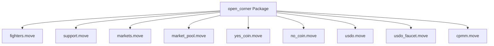

# Deployed Contracts Documentation

## Deployment Information

### Network: Sui Testnet

**Package ID:** `0x3a66a0a93f80fb6c04b7646bb03714d841dde728584204220e4edc06b6927106`

**Deployment Date:** November 15, 2025

**Explorer:** [Sui Explorer](https://suiexplorer.com/object/0x3a66a0a93f80fb6c04b7646bb03714d841dde728584204220e4edc06b6927106?network=testnet)

---

## Package Structure

### Modules Overview



| Module | Purpose | Key Objects |
|--------|---------|-------------|
| `fighters` | Fighter profile management | `FighterProfile`, `FighterManagerCap` |
| `support` | Support vault & Supporter NFTs | `SupportVault`, `SupporterNFT` |
| `markets` | Market creation & resolution | `Market`, `ProtocolAdminCap`, `PositionNFT` |
| `market_pool` | CPMM pool for YES/NO trading | `MarketPool`, `MarketYes`, `MarketNo` |
| `yes_coin` | YES outcome coin | `YES_COIN`, `TreasuryCap<YES_COIN>` |
| `no_coin` | NO outcome coin | `NO_COIN`, `TreasuryCap<NO_COIN>` |
| `usdo` | Base currency token | `USDO`, `TreasuryCap<USDO>` |
| `usdo_faucet` | USDO faucet for testing | `USDOFaucet` |
| `cpmm` | Generic CPMM implementation | `Pool<X, Y>` |

---

## Deployed Objects

### Protocol Admin

**ProtocolAdminCap ID:** `0x4c811dd10af41044eee86deb2f1013807989db8a5b5451d81b2a197dac6954fa`

- **Purpose:** Administrative capability for creating and resolving markets
- **Access:** Required for `create_market()` and `resolve_market()` functions
- **Ownership:** Owned by deployer address

### Fighter Profile

**Fighter ID:** `0x7f35a33fca3ed3e23b0f104cb1acc1f4b9aeaf7d28a50463d2ca705d7fbc2904`

- **Type:** `open_corner::fighters::FighterProfile`
- **Status:** Shared object (publicly readable)
- **Vault Reference:** Linked to SupportVault

### Support Vault

**Vault ID:** `0xcfa550799b47e4df67097c8675577317c794fe6a16361aedaba9dae560cc3ccf`

- **Type:** `open_corner::support::SupportVault`
- **Status:** Shared object
- **Purpose:** Accepts SUI deposits for fighter support
- **Features:** Supporter NFT minting (Bronze/Silver/Gold tiers)

### Prediction Market

**Market ID:** `0x80da0c5ab4172133c59f21d806a2ae2245b12f014f9f7a973c312989b1fdc17d`

- **Type:** `open_corner::markets::Market`
- **Status:** Shared object
- **State:** OPEN (can be resolved by admin)
- **Pool ID:** `0xb6a10618c89292f833c4a6fcb2746b1471aa1dacd3772aebe912d496ac433ce1`

### CPMM Market Pool

**Pool ID:** `0xb6a10618c89292f833c4a6fcb2746b1471aa1dacd3772aebe912d496ac433ce1`

- **Type:** `open_corner::market_pool::MarketPool`
- **Status:** Shared object
- **Formula:** `yes_balance × no_balance = k` (constant product)
- **Collateral:** USDO locked 1:1 with YES/NO pairs

### Treasury Caps

**TreasuryCap<YES_COIN> ID:** `0x765d3ff4d81ed7834991d0ebf564b61bdf48cf449d67fc3b8fa3cf1b71fe72ef`

**TreasuryCap<NO_COIN> ID:** `0x510a870fae53fe3538bceb39f2db20c59bdf84f79c5faa3820a6d25d1c732e30`

**TreasuryCap<USDO> ID:** `0xebc9f98a29ad8d09c769300e345f6b6353ddffef670bfa4c4ae5a23f3c26f747`

- **Storage:** TreasuryCaps are stored in MarketPool for public access
- **Purpose:** Mint/burn YES_COIN, NO_COIN, and USDO tokens
- **Access:** Anyone can call functions that use these TreasuryCaps via MarketPool

### Coin Types

**YES_COIN Type:** `0x3a66a0a93f80fb6c04b7646bb03714d841dde728584204220e4edc06b6927106::yes_coin::YES_COIN`

**NO_COIN Type:** `0x3a66a0a93f80fb6c04b7646bb03714d841dde728584204220e4edc06b6927106::no_coin::NO_COIN`

**USDO Type:** `0x3a66a0a93f80fb6c04b7646bb03714d841dde728584204220e4edc06b6927106::usdo::USDO`

- **Decimals:** 9 (all coins)
- **Symbols:** YES, NO, USDO
- **Registration:** Registered in Sui Coin Registry

### USDO Faucet

**Faucet ID:** `0xa0d0a497aaf6600cfaa913f4a9891d74d9ecb97df1f8f2d28afd3379972cb0ca`

- **Type:** `open_corner::usdo_faucet::USDOFaucet`
- **Purpose:** Distribute USDO tokens for testing
- **Access:** Public (anyone can claim)

---

## Module APIs

### markets.move

#### Create Market
```move
public fun create_market(
    admin_cap: &ProtocolAdminCap,
    event_id: ID,
    question: vector<u8>,
    fee_bps: u64,
    vault_address: address,
    treasury_cap_yes: TreasuryCap<YES_COIN>,
    treasury_cap_no: TreasuryCap<NO_COIN>,
    ctx: &mut TxContext,
): ID
```

**Entry Wrapper:**
```move
public entry fun split_usdo_for_market(
    market: &mut Market,
    pool: &mut MarketPool,
    usdo_coin: Coin<USDO>,
    ctx: &mut TxContext,
)
```

#### Resolve Market
```move
public fun resolve_market(
    market: &mut Market,
    admin_cap: &ProtocolAdminCap,
    result: bool, // true = YES wins, false = NO wins
    ctx: &mut TxContext,
)
```

#### Market Operations
```move
public entry fun join_coins_for_market(...)
public entry fun swap_yes_for_no_for_market(...)
public entry fun swap_no_for_yes_for_market(...)
public entry fun redeem_winning_yes_for_market(...)
public entry fun redeem_winning_no_for_market(...)
```

### market_pool.move

#### Initialize Pool
```move
public fun init_market_pool(
    market_id: ID,
    treasury_cap_yes: TreasuryCap<YES_COIN>,
    treasury_cap_no: TreasuryCap<NO_COIN>,
    ctx: &mut TxContext,
): ID
```

#### Split USDO
```move
public fun split_usdo(
    pool: &mut MarketPool,
    usdo_coin: Coin<USDO>,
    ctx: &mut TxContext,
): (MarketYes, MarketNo, Coin<YES_COIN>, Coin<NO_COIN>)
```

#### Swap Operations
```move
public fun swap_yes_for_no(
    pool: &mut MarketPool,
    yes_coin: Coin<YES_COIN>,
    min_no_out: u64,
    ctx: &mut TxContext,
): Coin<NO_COIN>

public fun swap_no_for_yes(
    pool: &mut MarketPool,
    no_coin: Coin<NO_COIN>,
    min_yes_out: u64,
    ctx: &mut TxContext,
): Coin<YES_COIN>
```

#### Join Coins
```move
public fun join_coins(
    pool: &mut MarketPool,
    market_yes: MarketYes,
    market_no: MarketNo,
    yes_coin: Coin<YES_COIN>,
    no_coin: Coin<NO_COIN>,
    ctx: &mut TxContext,
): Coin<USDO>
```

#### Redeem Winning Coins
```move
public fun redeem_winning_yes_coins(
    pool: &mut MarketPool,
    market_yes: MarketYes,
    winning_coins: Coin<YES_COIN>,
    ctx: &mut TxContext,
): Coin<USDO>

public fun redeem_winning_no_coins(
    pool: &mut MarketPool,
    market_no: MarketNo,
    winning_coins: Coin<NO_COIN>,
    ctx: &mut TxContext,
): Coin<USDO>
```

#### View Functions
```move
public fun get_pool_balances(pool: &MarketPool): (u64, u64, u64)
public fun get_amount_out_yes_for_no(pool: &MarketPool, yes_in: u64): u64
public fun get_amount_out_no_for_yes(pool: &MarketPool, no_in: u64): u64
public fun get_yes_price_normalized(pool: &MarketPool): u64
public fun get_no_price_normalized(pool: &MarketPool): u64
```

### support.move

#### Create Vault
```move
public fun create_vault(
    fighter_id: ID,
    ctx: &mut TxContext,
): ID
```

#### Deposit
```move
public fun deposit(
    vault: &mut SupportVault,
    payment: Coin<SUI>,
    ctx: &mut TxContext,
)
```

#### Mint Supporter NFT
```move
public fun mint_supporter_nft(
    vault: &mut SupportVault,
    fighter_id: ID,
    tier: u8, // 1=Bronze, 2=Silver, 3=Gold
    metadata_url: vector<u8>,
    ctx: &mut TxContext,
)
```

### fighters.move

#### Create Fighter
```move
public fun create_fighter(
    name_hash: vector<u8>,
    socials_hash: vector<u8>,
    ctx: &mut TxContext,
): ID
```

---

## Architecture Highlights

### Shared Objects

All major objects are **shared objects**, enabling:
- ✅ Public read access
- ✅ Parallel transaction execution
- ✅ No permission requirements for read operations

**Shared Objects:**
- `Market` - Market state
- `MarketPool` - CPMM pool state
- `FighterProfile` - Fighter information
- `SupportVault` - Support vault state

### TreasuryCap Storage Pattern

**Design:** TreasuryCaps stored in MarketPool for public access

```move
public struct MarketPool has key {
    // ...
    treasury_cap_yes: TreasuryCap<YES_COIN>,  // Stored in pool
    treasury_cap_no: TreasuryCap<NO_COIN>,      // for public access
}
```

**Benefits:**
- ✅ Anyone can call `split_usdo()` without owning TreasuryCap
- ✅ Decentralized access (no single point of control)
- ✅ TreasuryCap owner doesn't need to sign every transaction

### CPMM Implementation

**Formula:** `yes_balance × no_balance = k` (constant product)

**Features:**
- No fees in MVP (can be added later)
- Automatic price discovery
- Arbitrage ensures `P_yes + P_no = 1`
- 1:1 collateral guarantee (1 USDO per YES+NO pair)

---

## Usage Examples

### TypeScript SDK Integration

```typescript
import { Transaction } from "@mysten/sui/transactions";
import { suiClient } from "@/lib/sui/client";

// Split USDO into YES/NO
const tx = new Transaction();
tx.moveCall({
  target: `${PACKAGE_ID}::markets::split_usdo_for_market`,
  arguments: [
    tx.object(MARKET_ID),
    tx.object(POOL_ID),
    tx.object(USDO_COIN_ID),
  ],
});

// Swap YES for NO
tx.moveCall({
  target: `${PACKAGE_ID}::market_pool::swap_yes_for_no`,
  arguments: [
    tx.object(POOL_ID),
    tx.object(YES_COIN_ID),
    tx.pure.u64(minNoOut),
  ],
});

// Redeem winning YES coins
tx.moveCall({
  target: `${PACKAGE_ID}::markets::redeem_winning_yes_for_market`,
  arguments: [
    tx.object(MARKET_ID),
    tx.object(POOL_ID),
    tx.object(MARKET_YES_ID),
    tx.object(YES_COIN_ID),
  ],
});
```

### Query Pool State

```typescript
// Get pool balances
const poolObject = await suiClient.getObject({
  id: POOL_ID,
  options: { showContent: true },
});

// Get price
const price = await suiClient.devInspectTransactionBlock({
  sender: "0x0",
  transactionBlock: {
    kind: "moveCall",
    data: {
      package: PACKAGE_ID,
      module: "market_pool",
      function: "get_yes_price_normalized",
      arguments: [POOL_ID],
    },
  },
});
```

---

## Security Features

### 1. Market ID Verification
- `MarketYes` and `MarketNo` wrappers include `market_id`
- Prevents cross-market attacks
- Verified in `join_coins()` and redeem functions

### 2. 1:1 Pair Enforcement
- `join_coins()` requires exact 1:1 YES:NO ratio
- Prevents fractional redemption attacks
- Ensures collateral integrity

### 3. Collateral Guarantee
- 1 USDO locked per (1 YES + 1 NO) pair
- 1:1 redemption: `1 winning coin = 1 USDO`
- No fractional reserve system

### 4. Wrapper Amount Matching
- Redeem functions verify `wrapper.amount == coin.amount`
- Prevents redeeming more than original deposit
- Limits swap-acquired coins from being redeemed

---

## Network Configuration

### Testnet RPC Endpoints

**JSON-RPC:** `https://fullnode.testnet.sui.io:443`

**GraphQL RPC:** `https://sui-testnet.mystenlabs.com/graphql` (stretch goal)

### Environment Variables

```bash
NEXT_PUBLIC_SUI_PACKAGE_ID=0x3a66a0a93f80fb6c04b7646bb03714d841dde728584204220e4edc06b6927106
NEXT_PUBLIC_SUI_NETWORK=testnet
NEXT_PUBLIC_SUI_RPC_URL=https://fullnode.testnet.sui.io:443
```

---

## Contract Addresses Summary

| Object | ID | Type |
|--------|-----|------|
| Package | `0x3a66a0a93f80fb6c04b7646bb03714d841dde728584204220e4edc06b6927106` | Package |
| Admin Cap | `0x4c811dd10af41044eee86deb2f1013807989db8a5b5451d81b2a197dac6954fa` | ProtocolAdminCap |
| Fighter | `0x7f35a33fca3ed3e23b0f104cb1acc1f4b9aeaf7d28a50463d2ca705d7fbc2904` | FighterProfile |
| Vault | `0xcfa550799b47e4df67097c8675577317c794fe6a16361aedaba9dae560cc3ccf` | SupportVault |
| Market | `0x80da0c5ab4172133c59f21d806a2ae2245b12f014f9f7a973c312989b1fdc17d` | Market |
| Pool | `0xb6a10618c89292f833c4a6fcb2746b1471aa1dacd3772aebe912d496ac433ce1` | MarketPool |
| TreasuryCap YES | `0x765d3ff4d81ed7834991d0ebf564b61bdf48cf449d67fc3b8fa3cf1b71fe72ef` | TreasuryCap<YES_COIN> |
| TreasuryCap NO | `0x510a870fae53fe3538bceb39f2db20c59bdf84f79c5faa3820a6d25d1c732e30` | TreasuryCap<NO_COIN> |
| TreasuryCap USDO | `0xebc9f98a29ad8d09c769300e345f6b6353ddffef670bfa4c4ae5a23f3c26f747` | TreasuryCap<USDO> |
| USDO Faucet | `0xa0d0a497aaf6600cfaa913f4a9891d74d9ecb97df1f8f2d28afd3379972cb0ca` | USDOFaucet |

---

## Testing & Verification

### Test Results

All Move unit tests pass:
```
[ PASS    ] open_corner::tests::test_create_fighter
[ PASS    ] open_corner::tests::test_create_market
[ PASS    ] open_corner::tests::test_create_vault
[ PASS    ] open_corner::tests::test_mint_supporter_nft
[ PASS    ] open_corner::tests::test_resolve_market
Test result: OK. Total tests: 5; passed: 5; failed: 0
```

### Verification Status

- ✅ Package published successfully
- ✅ All modules compiled without errors
- ✅ TreasuryCaps stored in MarketPool (v2 design)
- ✅ Shared objects configured correctly
- ✅ Coin types registered in Sui Coin Registry
- ✅ Initial seed data created

---

## Migration Notes

### Design Version

**Current:** v2 (TreasuryCaps stored in MarketPool)

**Previous:** v1 (TreasuryCaps passed as function arguments)

**Breaking Changes:**
- Old markets cannot be migrated
- New markets must use v2 design
- TreasuryCap arguments removed from `split_usdo_for_market()`

### Compatibility

- ✅ New markets: Use v2 design (TreasuryCaps in pool)
- ⚠️ Old markets: Continue to work but require TreasuryCap owner signatures

---

## References

- **Package Explorer:** [View on Sui Explorer](https://suiexplorer.com/object/0x3a66a0a93f80fb6c04b7646bb03714d841dde728584204220e4edc06b6927106?network=testnet)
- **Source Code:** `move/open_corner/sources/`
- **Deployment Script:** `scripts/deploy-package.ts`
- **Seed Data:** `SEED_DATA.json`

